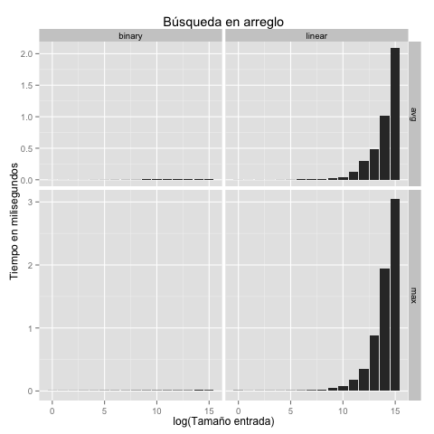
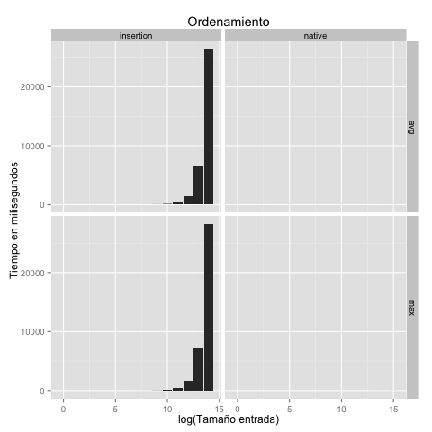

<table>
	<tr>
		<th colspan="2" style="text-align:center">
			<br/>
			Universidad Sim&oacute;n Bol&iacute;var<br/>
			Departamento de Computaci&oacute;n y Tecnolog&iacute;a de la Informaci&oacute;n<br/>
			Laboratorio de Algoritmos y Estructuras de Datos II (CI 2692)
	</tr>
	<tr>
		<th scope="row">Asignaci&oacute;n:</th>
		<td style="text-align:right">Laboratorio 1</td>
	</tr>
	<tr>
		<th scope="row">Modalidad:</th>
		<td style="text-align:right">Individual</td>
	</tr>
	<tr>
		<th scope="row">Ponderación:</th>
		<td style="text-align:right">2%</td>
	</tr>
	<tr>
		<th scope="row">Asignado:</th>
		<td style="text-align:right">Jueves, 26 de abril de 2018 (sem 1)</td>
	</tr>
	<tr>
		<th scope="row">Entrega:</th>
		<td style="text-align:right">Miércoles, 2 de mayo de 2018 (sem 2)</td>
	</tr>
</table>

### B&uacute;squeda en arreglos y ordenamiento por inserci&oacute;n

#### Objetivo:

Familiarizarse con la plataforma de trabajo GitHub Classroom y el lenguaje de programaci&oacute;n Python,
y realizar un primer ejercicio simple de programaci&oacute;n.
GitHub Classroom es una plataforma dise&ntilde;ada para la asistencia del disctado de cursos, en especial
cursos tipo laboratorio donde los alumnos deben trabajar sobre asignaciones y realizar entregas.
El lenguaje de programaci&oacute;n Python es un lenguaje interpretado de alto nivel que es sencillo
y bastante utilizado en la industria.

#### Programaci&oacute;n:

Cada grupo debe implementar los algoritmos de b&uacute;squeda lineal y b&uacute;squeda binaria
que buscan un elemento dado `x` dentro de un arreglo dado `A`, y retorna un &iacute;ndice `i`
tal que `A[i]=x`, o retorna -1 si el elemento `x` no se encuentra en `A`.

Adicionalmente, cada grupo debe implementar el algoritmo de ordenamiento por inserci&oacute;n
visto en clase.

Todos los procedimientos se deben implementar dentro de la plantilla `lab_01.py` provista,
en la parte del archivo prevista para ello. Las *firmas* de cada procedimiento son las siguientes:

```
def linear_search(A, x):
def binary_search(A, x):
def insertion_sort(A):
```

Todos los algoritmos se eval&uacute;an de forma *autom&aacute;tica* sobre fuentes
de datos provistas y se generan estad&iacute;sticos de tiempo de ejecuci&oacute;n.
Una vez que se hayan implementado los algoritmos, los experimentos se ejecutan
de la siguiente forma:

```
python lab_01.py > data.csv
```

Los datos quedan guardados en el archivo `data.csv` (.csv es la extensi&oacute;n
de los archivos Comma-Separated Values). Luego, usamos el programa estad&iacute;stico
R para generar gr&aacute;ficas del tiempo de corrida:

```
R --no-save < ../plots/plot_lab_01.R
```

Las gr&aacute;ficas deben lucir de la siguiente forma:




